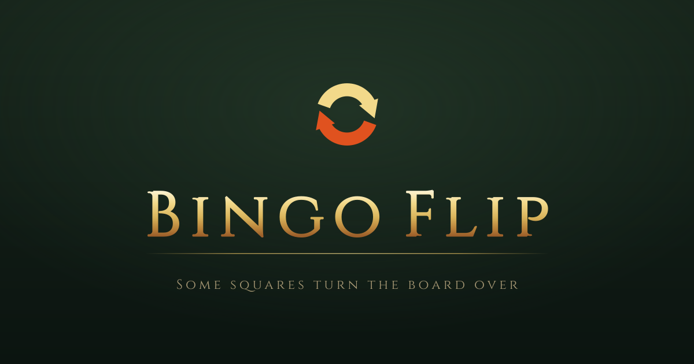

<p align="center">
  
</p>

# Bingo Flip

Lockout bingo with a twist. Teams race to complete a line on a shared board of Elden Ring
objectives — and three to five of those squares **flip the board**, turning every unclaimed square
onto a second set of objectives.

Inspired by Uno Flip, where a few cards turn the whole deck over.

Built for tournament play: any number of teams, spectator and caster views, and OBS browser sources
for streaming. No install, no desktop app, and nothing reading the game's memory. Players click the
squares themselves.

Vite + React + TypeScript, backed by Supabase (Postgres, Realtime, Anonymous Auth), deployed as a
static site.

## The flip rule

**A flip rewrites the objectives on the unclaimed squares and nothing else.**

There is one ownership grid for the whole match and it survives every turn. Lines and square counts
are read off that single grid, so a flip never gives anything back — it changes what your opponent
still has to do.

This is the decision everything else follows from. The alternative — a separate ownership grid per
face — makes each face its own lockout game, which means a team can sit one square from victory on a
face the opponent will simply never flip back to, and the match stops being a race.

Two consequences worth knowing before you host:

- **Flip squares are marked**, always. The race for them is the game, and a hidden one would make
  the turn feel arbitrary rather than earned.
- **Flip squares are consumed.** Claiming one turns the board and then leaves an ordinary owned
  square behind, so a match flips at most as many times as it has flip squares. That is why there is
  no cooldown rule anywhere: the supply is the limit.

## How a match works

1. **Home.** Create a room, or join with the room's word-pair code.
2. **Lobby.** Players pick a team (up to nine, by colour). The host sets the square set, lockout,
   whether bingos win or score, and how many squares flip.
3. **Ready up.** The host opens the board and every team confirms it is here. Nothing is on a clock
   in this phase — the match opens by itself the moment the last team says it's ready, so nobody
   starts a square behind because they were still alt-tabbed.
4. **Preparation.** A countdown where both faces can be read but nothing claimed. You can turn the
   board over by hand here to read the other side. This matters more than Battleship's placement
   phase did: a flip board asks you to plan against objectives that aren't currently on the table,
   so this is where you work out which face you'd rather be racing on — and therefore whether you
   want to reach a flip square first, or keep your opponent off one.
5. **Match.** Go and do the thing written on a square, then click it. Real-time, not turn-based.
   Clicking a square you already hold releases it, for the misclick.
6. **Somebody takes it.** The host can start another match in the same room.

If a lockout board runs out — every square gone and nobody has met the win condition — the match is
decided on the score: most squares, plus the bingo bonus if the room pays one. A tie at the top is a
genuine draw and the match finishes with no winner. It is not a rare case: a 5×5 split between two
teams does not always contain a bingo.

### Settings

The board is always **5×5**. Not a default — the only size, enforced by a check constraint. Every
square has to be readable at a glance on *both* faces, because the whole tactical question is what
the unclaimed ones will become, and twenty-five objectives is already the most anybody holds in their
head mid-race.

| Setting | Options | Default |
| --- | --- | --- |
| Squares | Objectives: Base+DLC / Base / DLC / Ringus | Base+DLC |
| Squares belong to | Lockout / Non-lockout | Lockout |
| Bingos | Win / Score | Win |
| A bingo is worth | 0, 1 or 2 points | 1 |
| First to | a target score | 13 |
| Flip squares | 3, 4 or 5 | 3 |

**Lockout** is the mode the flip was designed around: squares are finite, so a flip that hardens
your opponent's remaining work actually costs them something. **Non-lockout** lets every team claim
every square, and the winner is whoever completes the condition first. The flip means something
different there — nobody can be denied a square, so a flip doesn't take work away from anyone, it
changes what's on offer for everyone at once. Only the *first* completion of a flip square turns the
board, or four teams working through the same three squares would turn it a dozen times.

**Bingos win** is bingo proper: the first full row, column or diagonal takes the match. **Bingos
score** is the format plenty of events actually run — a square is a point, a completed line is worth
0, 1 or 2 more, and the first team to the target wins.

A third condition, `majority`, used to sit beside these and is gone. It was exactly points with a
bonus of zero and a target of half the board plus one, and two names for one rule is a difference
people have to be told about. Setting the bonus to 0 gets it back, and the target still defaults to
that same threshold — so the old behaviour is the default behaviour.

### The square sets

Both faces come out of **one** set and share no objective between them, so a board needs 50 genuinely
different trips. All four clear it comfortably:

| Square set | Distinct objectives | Shape |
| --- | --- | --- |
| Ringus | 200 | flat, untinted |
| Objectives: Base+DLC | 188 | squareset, region-tinted |
| Objectives: Base | 141 | squareset, keyword-tinted |
| Objectives: DLC | 95 | squareset, keyword-tinted |

Distinct *objectives*, not distinct entries. These sets write some errands twice — once tagged
combined, once not — as separate squares: `Kill Both Mimic Tear Bosses` and the same line with `(C)`
are two rows in the Incursion set, and there are seven such pairs in it. They're different squares by
every mechanical measure and the same trip to a player, so dealing one to each face would flip you
onto the objective you just finished. The dealer normalises them together, and the counts above are
what survives that.

## How it stays fair without a game server

There is no backend process refereeing the match. Instead:

- Every browser gets an anonymous Supabase auth session, so it has a stable identity with no login
  screen. Signing in with Twitch is optional and only adds a name.
- **The board isn't stored.** Every client derives both faces from the room id, the square set and
  the match seed, so there's nothing to sync and nothing that can drift between players. The claim
  log is the only per-match state in the database.
- **Claims go through `claim_square()`**, a `SECURITY DEFINER` function. It locks the room row, then
  settles lockout, which face the claim landed on, whether the square flips the board, and whether
  it wins the match — all in one statement. Deciding any of those in a client would mean two clients
  reaching different answers about a match they're both in. There is deliberately no INSERT policy
  on `claims`, so that function is the only way in.
- **The face is derived, not stored.** It's the parity of the flip claims, computed from the log, so
  it can never drift out of step with the claims that caused it.
- One claim per team per square is a unique index. Lockout — at most one *team* per square — is a
  per-room setting, so it's enforced under the room lock rather than by a constraint.

Unlike Battleship, **nothing here is hidden from anybody.** That removed a whole layer: no private
per-team rows, no spectator reveal policy, no post-match reveal, and no credential for an overlay to
read behind RLS. Watching and playing now differ by exactly one thing — whether the squares can be
clicked.

## Streaming

Players get OBS browser sources from the **Stream overlay** button in the match screen. Casters get
a control page at `/cast/<room code>`.

| Source | Size | What it is |
| --- | --- | --- |
| Board | 1000×1000 | The board itself. A caster aims it live from the control page. |
| Clock | 1200×200 | Match clock, each team's squares, and which face is up. |
| Key | 1920×90 | A thin colour key for the bottom edge. |

The board source turns over on its own from the claim log, so a caster doesn't drive the flip and
can't forget to. The key deliberately does **not** flip: it lists the colours of both faces and
holds for the whole match, because a key that turned over would keep re-teaching a viewer the
vocabulary mid-match.

## One-time Supabase setup

1. Create a project at [supabase.com](https://supabase.com).
2. Under **Authentication > Sign In / Providers > Anonymous**, turn it on. Without this, nothing
   works.
3. Apply [`supabase/migrations/`](supabase/migrations) in filename order, either with
   `supabase db push` or one file at a time in the SQL Editor. See
   [supabase/README.md](supabase/README.md).
4. Under **Project Settings > API**, copy the Project URL and the `anon` public key into
   `.env.local`.

The `anon` key is public by design and ships in the JS bundle, since RLS is what protects the data.
The service role key is not public — it belongs only in `.env.local`, which is gitignored.

## Local development

```bash
npm install
cp .env.example .env.local   # fill in your Supabase URL + anon key
npm run dev
```

Two windows, or one normal and one incognito, will play a match against each other.

```bash
npm run build   # tsc -b && vite build, into dist/
npm run lint    # oxlint over src and scripts
npm run check   # the offline logic checks
```

### Check scripts

`scripts/` holds standalone checks that run offline under bare Node:

```bash
node --experimental-strip-types scripts/check-flip.ts         # the flip rules, both modes
node --experimental-strip-types scripts/check-square-names.ts # square set integrity
node --experimental-strip-types scripts/check-text-fit.ts     # names fit their squares
```

`check-flip.ts` is the one that matters. It exercises face disjointness at every size each set
allows, flip-square placement and reproducibility, the face parity, and win detection under both
lockout and non-lockout — including the case where two teams complete the same line and the earlier
one has to win.

## Deploying

```bash
npm run build
```

Then put the contents of `dist/` wherever you're serving from. `base` is `'./'` in
[vite.config.ts](vite.config.ts), so asset URLs are relative and the build doesn't care what the
repository is called or what path it's served from — a project site, a user site, or opened off
disk. HashRouter keeps all routing after the `#`, so there are no server-side rewrite rules either.

`npm run deploy` pushes `dist/` to a `gh-pages` branch if you'd rather do it that way.

Environment variables are baked in at build time, so the build has to run locally with `.env.local`
present. They are not read from GitHub.

## Status

This is a fresh rework and **has not yet been run against a live database.** The schema is written
and reasoned about but unapplied; the first thing to do is point it at a Supabase project and play a
match in two browser windows.

Not built yet, deliberately — these were Battleship features that need rewriting around flip
   semantics rather than porting:

   - **The deeper stats.** The records page at `/stats` covers who won, how long it took and who has
     been winning lately. The almanac, the record book, match reports and replay are not back. The
     Admin page's room and grant controls work; its archived-match and shot-log controls are gone
     with the archive layer they served.
- **Square counts** — per-teammate tallies on one square, for objectives like "Kill 3 Castle
  Bosses". Arguably a better fit for a bingo board than it was for Battleship, and worth restoring.

## Credits

**Square sets.** The boards are dealt from sets written by the people who run these events:

- **Objectives: Base+DLC**, **Objectives: Base** (Rookie Rumble), **Objectives: DLC** (Scadubingo
  League) and **Ringus**, by [IgniteSouls](https://github.com/ignitesouls).

All four are other people's work, included with permission, and are **not** covered by this project's
licence. The colour-name companion files (`*ColorNames.json`) are this project's.

Elden Battleship's fifth set, **Bosses**, is not here. It was a flat list of bosses to kill, which
suits a grid you are hunting ships on better than one you are racing to complete — every square the
same kind of errand makes for a board with no shape to plan against, and the flip has nothing
interesting to turn it into.

**Elden Battleship.** This project is a rework of
[Elden Battleship](https://github.com/KCBrazos/Elden-Battleship), and most of what isn't the game
itself came from there: rooms, realtime, the board renderer's text fitting, the OBS sources, the
caster's desk. Commits before August 2026 are that project's history.

**EldenBingo.** Which in turn grew out of [EldenBingo](https://github.com/awsker/EldenBingo) by
Asker, the desktop bingo app the tournament scene was already using. This app carries none of its
C#, but it isn't independent of it either: `teamColors.ts` is a port of its `BingoConstants.cs`
colour table so a player's colour means the same thing in both, `squareSetFormat.ts` reads its
squareset format, and the lockout/non-lockout distinction is its `GS_Lockout`. EldenBingo is GPL-3,
and so is this.

**Elden Ring** is FromSoftware's. Boss names, region names and everything else drawn from the game
belong to them. This is an unofficial fan project, not affiliated with or endorsed by FromSoftware
or Bandai Namco.

## Licence

GPL-3.0-or-later. See [LICENSE](LICENSE).

### Using this?

Please do. Fork it, run it for your own event, take pieces out of it. The only ask is that changes
you distribute stay open under the same licence, which is what GPL means in practice — and if you do
something interesting with it, say hello.

Note that running a modified copy as a website is **not** distribution, so hosting your own version
obliges you to publish nothing. That is deliberate; AGPL was the alternative and it seemed a heavier
promise than this needs.

I would like to hear about it, though. Open an issue, or find me as KCBrazos on GitHub.
